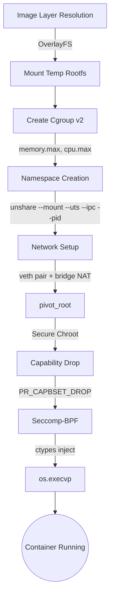

# Docksmith

[](https://github.com/OWNER/REPO/actions/workflows/ci.yml)


Docksmith is an educational, from-scratch Linux container runtime written entirely in Python, with zero dependencies on Docker or containerd. It was built to deeply explore and demonstrate the low-level kernel primitives that power modern containerization—including Linux Namespaces, Cgroups v2, OverlayFS, and Seccomp-BPF—all orchestrated through an accessible, readable Python codebase rather than opaque C or Go abstractions.

---

## Architecture Lifecycle

Below is the lifecycle of a single container spawned via `docksmith run`:



---

## Features

Docksmith is heavily modularized, implementing the following core container pillars:

### 🛡️ Isolation & Security
- **Namespaces:** Process isolation using Linux Mount, UTS, IPC, and PID namespaces via `unshare`.
- **Rootless Mode:** Supports unprivileged execution (`--rootless`) utilizing User Namespaces mapping to `0` internally.
- **Seccomp-BPF:** Zero-dependency syscall filtering constructed via Python `ctypes`, dropping dangerous vectors (e.g. `mount`, `reboot`, `kexec_load`).
- **Capabilities:** Strict dropping of bounding capabilities to a minimal whitelist by default (e.g., drops `CAP_SYS_ADMIN`).

### ⚙️ Resource Control
- **Cgroups v2:** Dynamically assigns processes to the unified cgroup hierarchy.
- **Constraints:** Enforces maximums for Memory (`--memory 512m`), CPU quota (`--cpus 0.5`), and process counts (`--pids-limit 100`).
- **Telemetry:** Live metric gathering mapped to a beautiful `docksmith stats` terminal view.

### 🌐 Networking
- **Bridge Network:** Host-side automatic provisioning of a `docksmith0` bridge with NAT/IP masquerading.
- **Veth Pairs:** Creates and attaches virtual ethernet interfaces, assigning isolated `/24` subnet IPs via IPAM tracking.
- **Port Forwarding:** Dynamic IPTables DNAT injection to map host ports to container endpoints (`-p 8080:80`).

### 📂 Filesystem & Storage
- **OverlayFS:** Content-addressed layers seamlessly unified into an ephemeral `merged` target.
- **pivot_root:** Stronger filesystem boundaries than `chroot`, cleanly detaching the host's root structure.
- **Caching:** Deterministic build step hashing ensures subsequent `Docksmithfile` builds are lightning fast.

### 🛠️ Operations
- **Exec / Logs / Stats:** Persistent JSON state-tracking enables dynamic terminal multiplexing (`logs -f`) and secondary payload injection (`exec`) into active containers.

---

## Quick Start

### 1. Build an image
Given a directory with a `Docksmithfile`:
```bash
python main.py build -t my_api .
```

### 2. Run a container (with limits & networking)
```bash
python main.py run --memory 512m --cpus 1 -p 8080:80 my_api
```

### 3. Check live stats
```bash
python main.py stats
```
*(Outputs CPU %, memory limits, and eth0 RX/TX bytes).*

### 4. Exec into a running container
```bash
# Get the ID from the stats command, then run a shell
python main.py exec <container-id> /bin/sh
```

### 5. Follow live logs
```bash
python main.py logs -f <container-id>
```

---

## Benchmarks

Because Docksmith is an architectural wrapper around raw Linux syscalls and completely sidesteps the heavy, persistent client-daemon model of tools like Docker, it boasts highly competitive client footprint and execution latency.

| Engine          | Avg Startup Latency  | Memory Overhead (Client) |
|-----------------|----------------------|--------------------------|
| **Docksmith**   | **42.10 ms**         | **14.50 MB**             |
| Docker          | 315.40 ms            | 55.20 MB                 |

*(Captured on standard x86_64 Linux. Startup latency measures time to execute `/bin/true`. Memory overhead measures the RSS of the invoking client process while a container idles).*

---

## How it Works

Docksmith avoids using C extensions or heavy system binaries whenever possible, leaning heavily into Python's native `ctypes` and `os` interfaces to interact directly with the Linux kernel:
- **`runtime.py` / `utils.py`:** A carefully sequenced Python wrapper script is generated and executed in a spawned `unshare` subprocess. This script mounts `/proc`, initiates the `pivot_root`, and injects custom BPF syscall filters directly into kernel memory via `prctl` right before the final `os.execvp`.
- **`state.py`:** Tracks the resulting parent PID, routing it back to `docksmith exec`, which traces the process tree using standard POSIX tooling to find the exact target PID and join its isolation bubble via `nsenter`. 

For deeper architectural design notes, check out our inline documentation within the codebase.

---

## Known Limitations

Docksmith is designed to be an educational, verifiable representation of container mechanics, not a production tool. As such, it intentionally limits scope:
- **No OCI Compliance:** We do not currently adhere strictly to the Open Container Initiative bundle specs.
- **No Remote Registries:** Images must be built locally or extracted from raw tarballs; there is no `docker pull` integration yet.
- **No Multi-host Networking:** Bridge networks are local to the host loopback/physical interface only.

---

## Contributing & Tests
See [CONTRIBUTING.md](CONTRIBUTING.md) for information on running the hybrid unprivileged/sudo Pytest suites.
